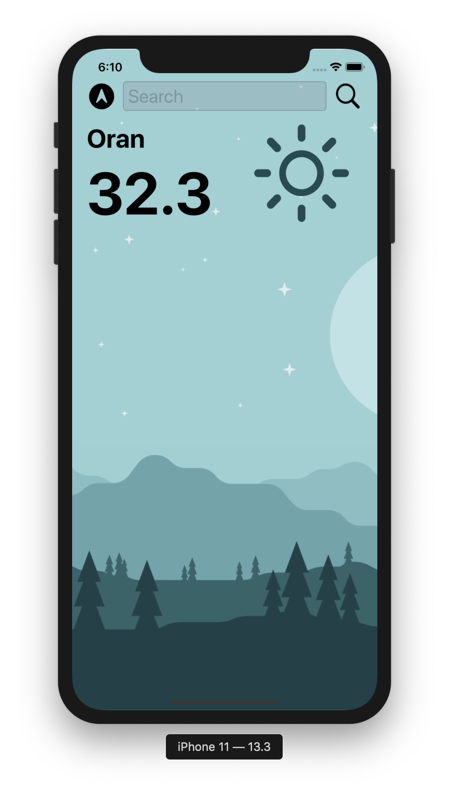
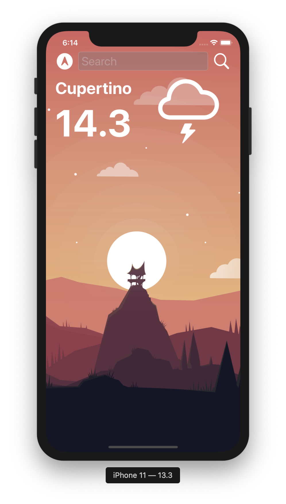
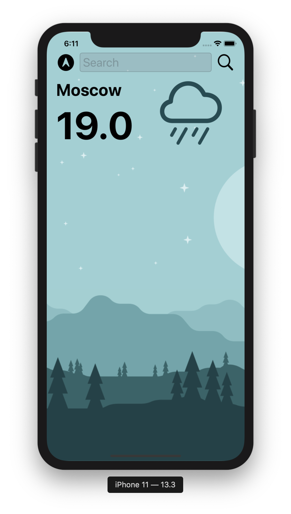

# Weather-iOS13

● Creating a dark-mode enabled app.

● Using of vector assets.

● UITextField for getting user input.

● Working with APIs by making HTTP requests with URLSession.

● Parse JSON with the native JSONDescoder.

● Using computed properties, closures and extensions.

● Using Core Location for getting the GPS data.

  
